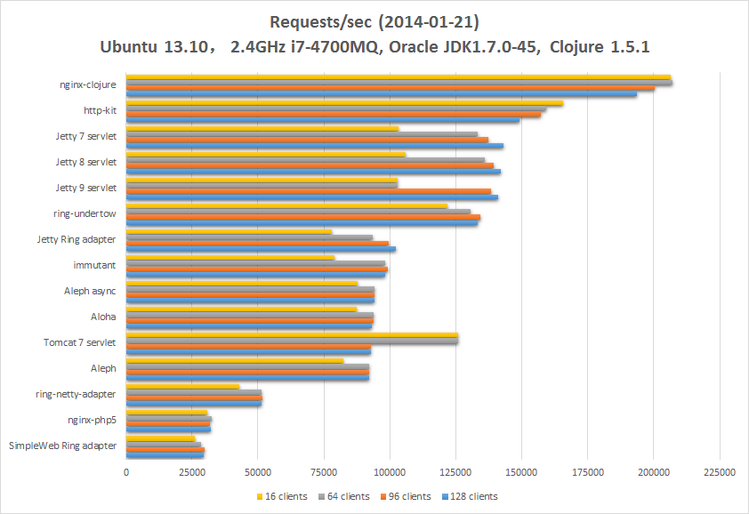

# Clojure web server shoot-out

This is a **collaborative repo**. Please see [here](#contact--contribution) for info on contributors & contributing.

## Latest Results

### 2014 Nov 6

  * **Processor**: 2x 2.66GHz Xeon [X5650](http://ark.intel.com/products/47922/Intel-Xeon-Processor-X5650-12M-Cache-2_66-GHz-6_40-GTs-Intel-QPI) (total 24 hardware threads).
  * **Memory**: 144GB.
  * **OS**: Ubuntu 14.04.
  * **Clojure**: 1.7.0-alpha2 on Oracle JDK7.
  * Raw data (incl. latencies) available [here](results/20141106-13-28).

  

### 2014 May 3

  * **Processor**: 1x 2.9GHz Intel Core [i7-3520M](http://ark.intel.com/products/64893/Intel-Core-i7-3520M-Processor-4M-Cache-up-to-3_60-GHz) (total 4 hardware threads).
  * **Memory**: 16GB 1600MHz DDR3.
  * **OS**: Fedora 19.
  * **Clojure**: 1.5.1 on OpenJDK 1.7.0-51.
  * Raw data available [here](http://goo.gl/2FtAFy).

  

### 2014 Feb 21

  * **Processor**: 1x 2.4GHz Intel Core [i7-4700MQ](http://ark.intel.com/products/75117/Intel-Core-i7-4700MQ-Processor-6M-Cache-up-to-3_40-GHz) (total 8 hardware threads).
  * **Memory**: 16GB 1333MHz DDR3.
  * **OS**: Ubuntu 13.04.
  * **Clojure**: 1.5.1 on Oracle JDK7 build  1.7.0_45.
  * Raw data available [here](http://goo.gl/XrHk7C).

  

## Configuration

  * Response length: 1163 bytes (`servers/index.html`).
  * wrk - `wrk -t 16 -c <32, 64, 128, 256, 512, 1024> -d 60s`.
  * Leiningen `trampoline`, `:jvm-opts ["-server"]`.
  * See `scripts/tune_linux.sh` , `scripts/tune_macosx.sh`  for details about OS tuning. Please run the related tune_xxx.sh before starting servers or ab.
  * See `scripts/bench.sh` for full details.
  * **Detailed benchmark results** available in `/results/`.
  * **Clojure Google Group discussion**: http://goo.gl/xe46R.

## Servers

  * [Jetty Ring adapter](https://github.com/ring-clojure/ring) - Standard Ring adapter.
  * [http-kit](https://github.com/shenfeng/http-kit) - HTTP client/server with async & WebSockets support.
  * [Aleph](https://github.com/ztellman/aleph) - Clojure framework for asynchronous communication, built on top of Netty and Manifold.
  * Jetty 7/8/9, Tomcat 7/8 servlets via [lein-servlet](https://github.com/kumarshantanu/lein-servlet).
  * [nginx 1.4.4](http://nginx.org) + [php5-fpm 5.5.3+dfsg-1ubuntu2.1](http://php-fpm.org/)
  * [nginx-clojure 0.2.6](https://github.com/xfeep/nginx-clojure) compiled into [nginx 1.4.4](http://nginx.org)  .
  * [Immutant 1.1.1](http://immutant.org/)
  * [Immutant 2 "thedeuce"](https://github.com/immutant/immutant)
  * [Undertow Ring adapter 0.2.1](https://github.com/piranha/ring-undertow-adapter)

## Contact & contribution

This is a **collaborative repo** maintained by [a number of contributors](https://github.com/ptaoussanis/clojure-web-server-benchmarks/graphs/contributors). Thanks to everyone for making this possible!

### Welcoming *pull requests* for:
  * Additional web servers.
  * Updated servers (no snapshot releases please).
  * Server / bench config tuning!

### If you are submitting a pull request to update results

  1. Please try to **include graph/s** when possible. We're looking primarily at relative numbers here so it's not a big deal if the hardware changes between PRs, so long as it's documented and mentioned in any graphs.
  2. Please try ensure that **all** servers being benchmarked have a **reasonable configuration for your hardware environment**. This is especially important if your hardware environment is unusual (e.g. fewer/more cores than usual). If you're unclear on how to adjust some server's configuration for your environment, feel free to open an issue to check that the config you're proposing seems solid to interested maintainers.

You can reach me (Peter Taoussanis) at [taoensso.com](https://www.taoensso.com), or the other contributors through the [issues page](https://github.com/ptaoussanis/clojure-web-server-benchmarks/issues?state=open).
